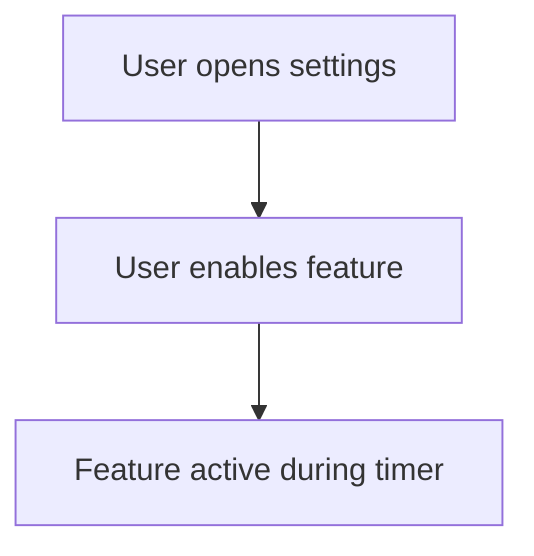

## Summary

(_Brief description of the enhancement. Example: "Add haptic feedback when phase changes"_)

---

## Problem

(_What limitation or need does this enhancement address?_)

---

## Proposed Solution

(_How should this enhancement work? Describe the user experience_)

---

## User Value

(_Why would this improve the app? How does it benefit users?_)

---

## User Interaction

(_How will users interact with this feature?_)

(_Optional: Include mockups, user flow diagrams, or Mermaid diagrams if helpful_)

---

## Additional Context

(_Any other details, mockups, screenshots, or references_)

---

/label ~enhancement
