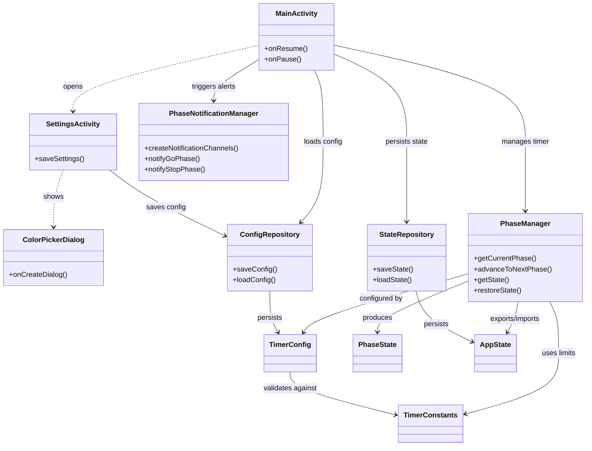

# General Architecture

## Component Responsibilities

| Component                    | Role                                                   |
|------------------------------|--------------------------------------------------------|
| **MainActivity**             | Timer display, countdown execution, lifecycle handling |
| **SettingsActivity**         | User input for configuration                           |
| **ColorPickerDialog**        | RGB color selection with live preview                  |
| **PhaseNotificationManager** | Sound/vibration alerts for phase changes               |
| **PhaseManager**             | Phase state machine, growth calculation                |
| **TimerConfig**              | User preferences (immutable)                           |
| **AppState**                 | Runtime state snapshot for persistence                 |
| **PhaseState**               | Current phase info for UI rendering                    |
| **Repositories**             | SharedPreferences abstraction                          |
