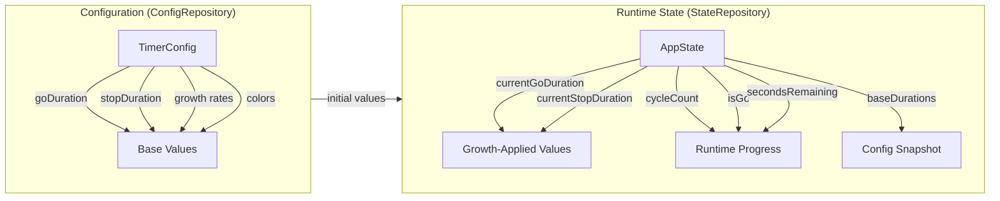

# State Management

The app maintains two distinct types of persisted data:

## Configuration vs Runtime State



| Aspect | TimerConfig | AppState |
|--------|------------|----------|
| **Changed by** | User in settings | Timer execution |
| **Durations** | Base values | Growth-adjusted values |
| **Purpose** | What user wants | Where timer is now |

## Lifecycle Scenarios

### Rotation / Process Death
- Config unchanged
- Restore full AppState (including `secondsRemaining`)
- Timer continues from where it was

### Settings Save
- Config saved to ConfigRepository
- State cleared from StateRepository
- Timer resets to full duration with new config

### Reset Button
- State cleared from StateRepository
- Config unchanged
- Timer resets to full duration with current config

### Pause/Resume
- `isPaused` tracked in MainActivity (not persisted)
- On pause: timer cancelled, `secondsRemaining` preserved
- On resume: new timer started with `secondsRemaining`

### Phase Transition
- `PhaseManager.advanceToNextPhase()` handles:
  - Go → Stop: simple toggle
  - Stop → Go: increment cycle, apply growth multipliers

## Growth Multiplier Application

Growth only applies when completing a full cycle (Stop → Go):

```
Cycle 1: goDuration=60, stopDuration=15
  [Go completes] → switch to Stop
  [Stop completes] → switch to Go, apply growth
Cycle 2: goDuration=66 (60×1.1), stopDuration=15
```

The `currentGoDuration` and `currentStopDuration` in AppState diverge from the base config values as cycles progress. The `baseGoDuration` and `baseStopDuration` fields track the original config for change detection.
